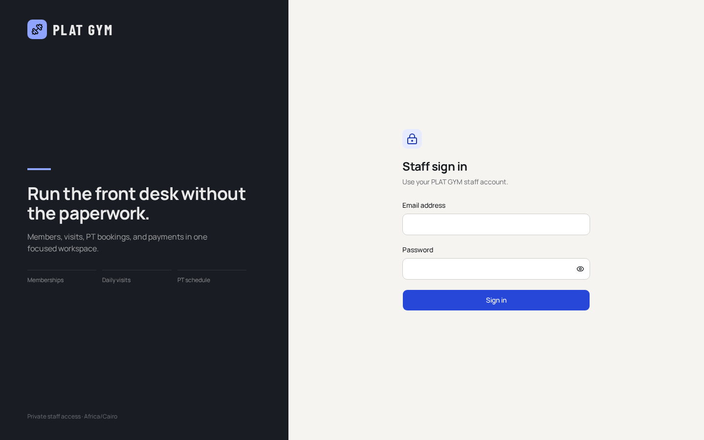
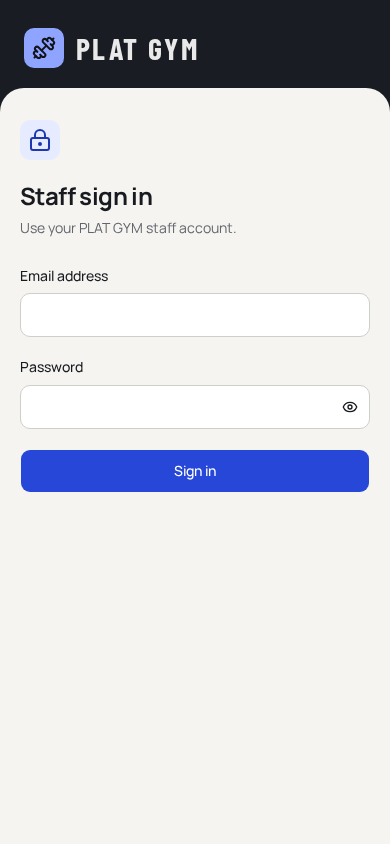

# PLAT GYM

Production-ready gym reception software for members, visits, membership expiry, personal-training bookings, payments, trainers, and membership plans.

## Release status

- Application implementation: **complete**
- Responsive desktop/mobile review: **complete**
- Production build: **passing**
- Unit tests: **4/4 passing**
- End-to-end workflows: **7/7 passing**
- Production database migration: **ready**
- Private source repository: **[Kero-holtz/plat-gym](https://github.com/Kero-holtz/plat-gym)**
- Hosted Supabase and Vercel deployment: **left to the operator**

No demo staff accounts, production users, local databases, or secrets are included. Automated tests use an isolated SQLite database and test-only identities that are never enabled by the production configuration.

See [`DEPLOYMENT_HANDOFF.md`](DEPLOYMENT_HANDOFF.md) for the exact deployment procedure. [`ASSISTANT_DEPLOYMENT_PROMPT.md`](ASSISTANT_DEPLOYMENT_PROMPT.md) is a ready-to-forward prompt for the person performing the deployment.

## Project documentation

- [`PROJECT_CONTEXT.md`](PROJECT_CONTEXT.md) — full sanitized product and implementation context
- [`docs/ARCHITECTURE.md`](docs/ARCHITECTURE.md) — runtime and data flow
- [`docs/DATABASE.md`](docs/DATABASE.md) — ER model, data dictionary, indexes, and RLS
- [`docs/API_REFERENCE.md`](docs/API_REFERENCE.md) — authenticated endpoint reference
- [`docs/ENVIRONMENT.md`](docs/ENVIRONMENT.md) — runtime/bootstrap/test variable boundaries
- [`docs/OPERATIONS_GUIDE.md`](docs/OPERATIONS_GUIDE.md) — manager and receptionist instructions
- [`docs/VALIDATION_REPORT.md`](docs/VALIDATION_REPORT.md) — test/build/security evidence
- [`docs/DECISIONS_AND_LIMITATIONS.md`](docs/DECISIONS_AND_LIMITATIONS.md) — scope and architecture decisions
- [`docs/PROJECT_HISTORY.md`](docs/PROJECT_HISTORY.md) — sanitized implementation history
- [`docs/FILE_MAP.md`](docs/FILE_MAP.md) — repository map
- [`CONTRIBUTING.md`](CONTRIBUTING.md) — safe change workflow
- [`CHANGELOG.md`](CHANGELOG.md) — release history

## Clean login preview

The production release has blank credential fields and no demo-account controls.

<p>
  
  
</p>

## Implemented product

- **Dashboard:** total members, Cairo-day visits, memberships expiring within 14 days, today's non-cancelled PT bookings, paid revenue in EGP, quick actions, expiring-member list, latest check-ins, and today's PT schedule.
- **Members:** search by name or phone, status filters, add, edit, profile, renewal, payment history, visit history, and one-click check-in.
- **Visits:** automatic timestamp, immediate dashboard/profile updates, and mandatory confirmation before admitting an expired member.
- **Personal training:** member, active trainer, date, available slot, price, payment status, confirmation, and persistent booking flow.
- **Bookings:** today/upcoming/all views with Scheduled, Completed, and Cancelled status changes.
- **Payments:** membership/PT records, Paid/Pending status, amount/date, search and filters, and paid-only dashboard revenue.
- **Trainers:** name, phone, specialization, active status, and seven-day availability editor.
- **Membership settings:** database-managed Monthly, 3 Months, 6 Months, and Yearly plans with automatic inclusive expiration calculation.
- **Authorization:** manager has full access; receptionist can operate members, visits, bookings, and payments but cannot mutate trainers or membership settings.
- **Responsive PWA:** installable manifest, desktop sidebar, mobile bottom navigation, safe-area support, accessible dialogs/forms, clear empty/error/loading states, and reduced-motion support.

## Technology

- Next.js 16 App Router, React 19, TypeScript, Tailwind CSS 4
- shadcn/Base UI primitives with locally packaged fonts
- Kysely and PostgreSQL/Supabase in production
- Supabase Auth with cookie-backed server sessions
- Isolated SQLite adapter strictly for local development and automated tests
- Vitest and Playwright
- Vercel deployment target

## Production data model

Migration: [`supabase/migrations/20260911140840_initial_gym_schema.sql`](supabase/migrations/20260911140840_initial_gym_schema.sql)

Core relationships:

- `auth.users` 1:1 `staff_profiles`
- `membership_types` 1:N `members`
- `members` 1:N `visits`
- `members` 1:N `bookings`
- `trainers` 1:N `trainer_availability`
- `trainers` 1:N `bookings`
- `members` 1:N `payments`
- `bookings` 0..1:N `payments`

The schema includes UUID keys, foreign keys, value constraints, operational indexes, a partial unique trainer/date/time index for race-safe collision prevention, least-privilege grants, and row-level security. The migration contains only the four initial plan definitions—no members, visits, payments, bookings, trainers, or staff accounts.

Operational dates use `Africa/Cairo`. Monetary values use PostgreSQL `numeric(10,2)` and display in EGP. Membership expiration is inclusive and clamps correctly at month end.

## Required production environment

```dotenv
NEXT_PUBLIC_SUPABASE_URL=
NEXT_PUBLIC_SUPABASE_PUBLISHABLE_KEY=
DATABASE_URL=
DB_SSL=true
DB_POOL_SIZE=5
```

Vercel builds fail early if the first three values are missing, and Vercel runtime refuses to fall back to SQLite. Never set `PLAT_GYM_TEST_MODE` on Vercel.

The service-role key and initial staff passwords are used only from a trusted machine while running the staff bootstrap script. They must not be committed or added to public/client variables.

## Local validation

Requirements: Node.js 20+ and npm.

```bash
npm ci
npm run lint
npm run typecheck
npm run test:unit
npm run test:e2e
npm run verify
npm run build
```

The Playwright web server creates `data/plat-gym-test.db` only when `PLAT_GYM_TEST_MODE=true`, runs the production server on port 3100, and deletes/rebuilds the database for each suite. The database, reports, screenshots, environment files, and build output are ignored by Git and excluded from the release archive.

The end-to-end suite covers:

- staff authentication and mobile responsiveness
- member creation, search, edit, status, renewal, and check-in
- visible expired-membership warning
- PT creation, availability, collision prevention, completion, cancellation, and payment linkage
- paid-versus-pending revenue behavior
- all five dashboard aggregates checked directly against relational queries
- receptionist authorization boundaries
- real dialog/form submission paths

## Manager quick guide

1. Start on **Dashboard** to review expirations, check-ins, PT sessions, and paid revenue.
2. Use the global search or **Members** to find a member. Press **Add visit** at entry; override an expired warning only after confirming with the member.
3. Use **Renew** to choose a plan, payment state, and amount. Expiration is calculated automatically.
4. Use **Personal Training** to select a member, trainer, enabled date, and available time.
5. Keep session status current in **Bookings** and payment status current in **Payments**.
6. Managers maintain trainer schedules and plan prices. Receptionists cannot change those settings.

## Known MVP boundaries

- One gym/branch, EGP currency, English interface, and Cairo timezone.
- Installable PWA shell, but operational writes require a network connection; no offline synchronization.
- No member deletion, payroll, commissions, inventory, recurring billing, advanced accounting, exports, analytics charts, or customer app.
- Current membership dates are stored on the member; payment history remains available, but there is no separate historical membership-period ledger.
- Staff provisioning is a trusted deployment task rather than an in-app user administration screen.
- Backups, monitoring, custom domain, SMTP, and secret rotation are operator/hosting responsibilities.
