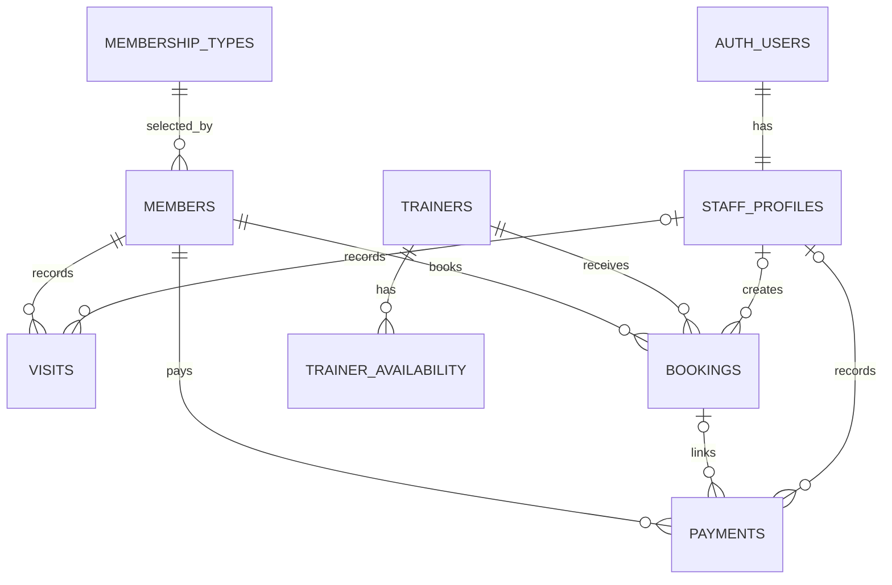

# Database Schema and Security

## Source of truth

Production migration:

```text
supabase/migrations/20260911140840_initial_gym_schema.sql
```

Do not run local SQLite DDL against Supabase. After the initial migration has been applied to production, future schema changes must be new timestamped migrations.

## Entity relationship diagram



## Data dictionary

### `staff_profiles`

| Column | Type | Rules |
|---|---|---|
| `id` | UUID | PK and FK to `auth.users(id)`, cascade delete |
| `name` | text | required |
| `email` | text | required, unique |
| `role` | text | `manager` or `receptionist` |
| `active` | smallint | 0 or 1, default 1 |
| `created_at` | timestamptz | default now |

Created only by the trusted bootstrap/service role.

### `membership_types`

| Column | Type | Rules |
|---|---|---|
| `id` | UUID | PK |
| `name` | text | required, unique |
| `duration_months` | integer | 1–60 |
| `price` | numeric(10,2) | non-negative |
| `active` | smallint | 0 or 1 |
| `created_at` | timestamptz | default now |

Initial rows: Monthly, 3 Months, 6 Months, Yearly.

### `members`

| Column | Type | Rules |
|---|---|---|
| `id` | UUID | PK |
| `name` | text | required |
| `phone` | text | unique Egyptian mobile pattern |
| `membership_type_id` | UUID | required FK to `membership_types` |
| `start_date` | date | required |
| `expiration_date` | date | required, not before start |
| `notes` | text | optional |
| `created_at` | timestamptz | default now |
| `updated_at` | timestamptz | default now, app-maintained |

The member row stores the current membership period. Renewal payments remain in `payments`.

### `visits`

| Column | Type | Rules |
|---|---|---|
| `id` | UUID | PK |
| `member_id` | UUID | required FK to members, cascade delete |
| `visit_time` | timestamptz | required, default now |
| `recorded_by` | UUID | FK to staff profile |

### `trainers`

| Column | Type | Rules |
|---|---|---|
| `id` | UUID | PK |
| `name` | text | required |
| `phone` | text | required, unique Egyptian mobile pattern |
| `specialization` | text | required |
| `active` | smallint | 0 or 1 |
| `created_at` | timestamptz | default now |

### `trainer_availability`

| Column | Type | Rules |
|---|---|---|
| `id` | UUID | PK |
| `trainer_id` | UUID | required FK, cascade delete |
| `weekday` | smallint | 0 Sunday through 6 Saturday |
| `start_time` | time | required |
| `end_time` | time | required and after start |

The complete interval tuple is unique per trainer.

### `bookings`

| Column | Type | Rules |
|---|---|---|
| `id` | UUID | PK |
| `member_id` | UUID | required FK |
| `trainer_id` | UUID | required FK |
| `booking_date` | date | required |
| `start_time` | time | required |
| `status` | text | scheduled, completed, or cancelled |
| `price` | numeric(10,2) | non-negative |
| `created_by` | UUID | FK to staff profile |
| `created_at` | timestamptz | default now |
| `updated_at` | timestamptz | app-maintained |

`trainer_booking_slot_unique` is a partial unique index on trainer/date/time where status is not cancelled. It is the final race-safe collision guard.

### `payments`

| Column | Type | Rules |
|---|---|---|
| `id` | UUID | PK |
| `member_id` | UUID | required FK |
| `booking_id` | UUID | optional FK, set null on booking delete |
| `amount` | numeric(10,2) | non-negative |
| `payment_type` | text | membership or pt |
| `status` | text | paid or pending |
| `payment_date` | date | required |
| `recorded_by` | UUID | FK to staff profile |
| `created_at` | timestamptz | default now |

## Important indexes

- Lowercase member name search
- Member expiration
- Membership type FK
- Visit member/time and global time
- Booking date/time, member, and trainer
- Payment date/status, member/date, and optional booking
- Trainer availability trainer/weekday
- Partial unique active trainer slot

## Row-level security

RLS is enabled on every public table. Anonymous access is revoked.

### Active staff

An authenticated user must have a matching `staff_profiles.id = auth.uid()` and `active = 1` to read operational data.

### Manager and receptionist

Both roles may:

- insert/update members
- insert visits tied to their own staff ID
- insert/update bookings
- insert/update payments

### Manager only

Only managers may:

- insert/update membership types
- insert/update trainers
- insert/update/delete trainer availability

The Next.js API independently enforces the same permissions. RLS is defense in depth for Data API access; direct PostgreSQL credentials remain server-only.

## No production seed

The migration inserts only plan configuration. There is no staff or operational seed SQL. `supabase/config.toml` disables Supabase seeding. Automated fixture generation is gated in the local SQLite adapter and cannot run on Vercel.
